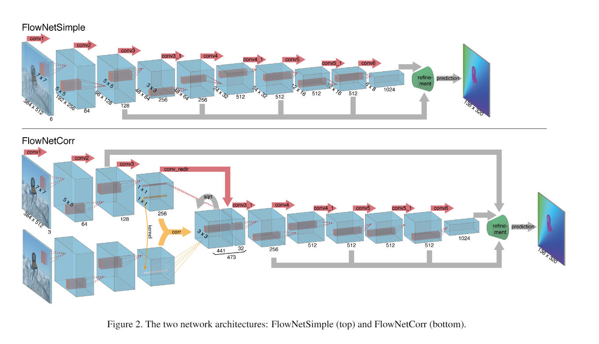

[](https://travis-ci.com/shauray8/Calib-Challange)

# Commaai's Calib-Challange
## Goal
the goal is to predict the direction of travel (in camera frame) from provided dashcam video. (yaw and pitch, fortunately, no roll)
</br></br>
[Commaai's](https://github.com/commaai/calib_challange) repo provides 10 videos. Every video is 1min long and 20 fps.</br>
5 videos are labelled with a 2D array describing the direction of travel at every frame of the video with a pitch and yaw angle in radians.</br>
5 videos are unlabeled. It is your task to generate the labels for them.</br>
The example labels are generated using a Neural Network, and the labels were confirmed with a SLAM algorithm.</br>
You can estimate the focal length to be 910 pixels.</br>
</br>
<p align="center">
  </img>
</p>
</br>
Extending the goals and making myself a functional device that can meke my car drive itself. </br>
what are the things I have to consider when writing code (still thinking)

</br>
So its a lot of classes I have to think some clever way to get it down.</br>

## Evaluation
They will evaluate our mean squared error against our ground truth labels. Errors for frames where the car speed is less than 4m/s will be ignored. Those are also labelled as NaN in the example labels.
</br></br>
commaai's repo includes an eval script that will give an error score (lower is better). You can use it to test your solutions against the labelled examples. They will use this script to evaluate your solution.

## Architecture 
I am thinking of using some kind of optical flow model and rather than doing some kind of image stabilization or something I'll make it yield Yaw and Pitch of the moving vehicle.
</br></br>
Adding details about the architecture soon!
### 1. FlowNetCorr

I'm gonna keep it short, sweet and to the point </br>
So the architecture used was taken from this [reseach paper](https://arxiv.org/pdf/1504.06852.pdf)
it's ConvNets again !! predicting stuff like optical flows is not easy and surely you can not do it with a single input image. </br>

A straightforward step is to create two separate, yet identical processing streams for the
two adjacent frames and to combine them at a later stage (after 3 convs in this case).</br>

In the research paper to concatenate the outputs for the convnets, they used "CORRelation layer"
but I don't think it makes a lot of difference. </br>

</br></br>
after a bunch of ConvNets, it goes through a refinement layer the output for the above architecture
is the input for the refinement layer!
<p align="center">
</img></br></br>
</p>
This pretty much summarizes the architecture and at the end rather than implementing the last layer
I make the matrix pass through a Linear layer and predict yaw and pitch with ONE HOT vector kinda thing.
If you have a better idea for the ONE HOT vector alternative just let me know !!</br>

### 2. Global Motion Aggregation

### 3. MarkFlowNet --> no implimentation 
### 4. FlowNet2.0 --> no implimentation 

## Navigation
[Labelled dataset](./labeled) [by comma]</br>
[Unlabeled test dataset](./unlabeled) [by comma]</br>
[Eval script](eval.py) [by comma]</br>
[Models and training script](./calib_scripts)</br>
[Setup](setup.py) </br>
[Pretrained weights](./pretrained_models/)</br>
[what the user sees (software)](./soft_serve_python)</br>
[what the user sees (webpage)](./web_serve_js)</br>
[segmentation](./U-net2_segnets)</br>

## ToDo
- [x] Visualizing the data
- [X] MaskFlow net
- [x] FlowNet corr (not as good as I thought)
- [ ] Gma
- [X] Training the model( on azure cause i have .edu email :) ) PS. Azure is useless  !
- [ ] SLAM
- [X] Write utility functions ( done for flownet working on GMA )
- [ ] Build and Deploy with QT5 in the [pedal](https://github.com/shauray8/pedal) repo. 
- [ ] Update README
- [ ] Segment comma 10k dataset
- [ ] Pilotnet
- [ ] Implement the research papers from george and do some viz on it use future images for pred lines (yaw and pitch)
- [ ] Depth_net 

I have to deploy it and retrain it on new data and keep on doing that !
</br>
for now I'm not doing it in real time or with time i will make this thing work with carla 
</br>

I'm so lazy to compelete the code. If there is anyone to compelete it for me go on !!

## How to tinker/use the code?

* you can monitor the training process with tensorboard:</br>
```
tensorboard --port=PORT --logdir=pretrained
```

* pretrained model is a little too heavy for github, uploading on google drive
```
https://drive.google.com/file/d/1kxpD8DmL-CQIB02zxah_-BIoM6spcBJF/view?usp=sharing
```

* training script for flownetCorr is [here](./calib/train_flownetcorr.py)
```
  - python train_flownetcorr --help (for all the arguments and folder locations)
  - the training loop is in the 'train' function.
  - the validation loop is in the 'validation' function.
  - there are relevent comments before every piece of code so it is not that tough to identify and change stuff.
  - it uses MSE loss that is the squared of the mean of the losses through the batchsize.

```
* FlownetCorr model is [here](./calib/FlownetCorr.py)
```
  -
```
adding soon be patient!

## example of how opensource is changing the world !! 
[comma ai](https://github.com/commaai)
